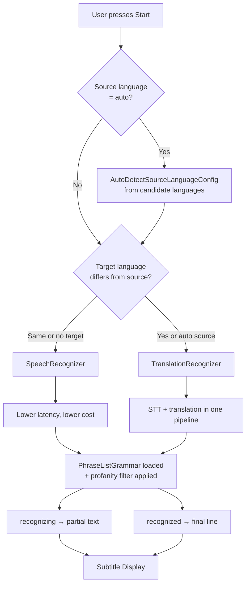
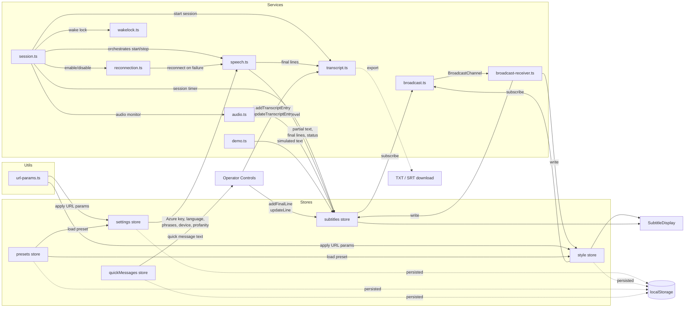
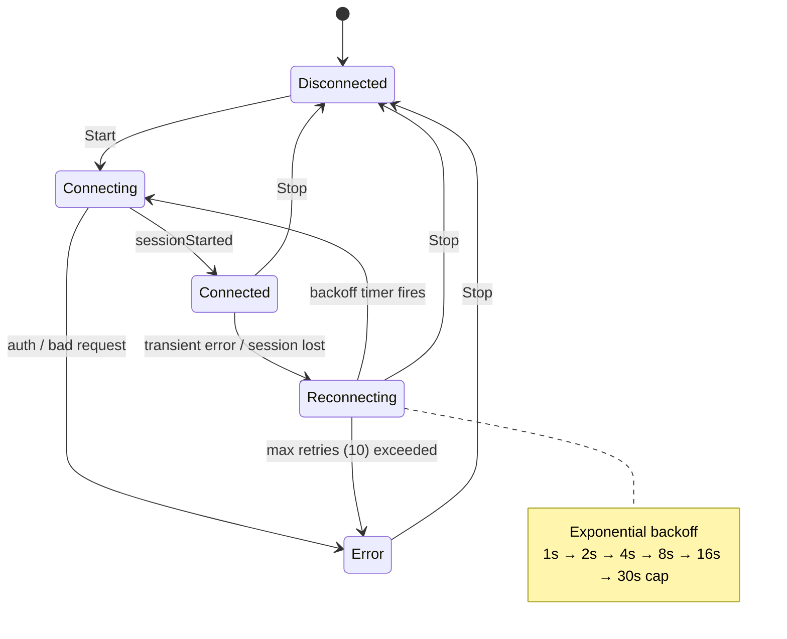
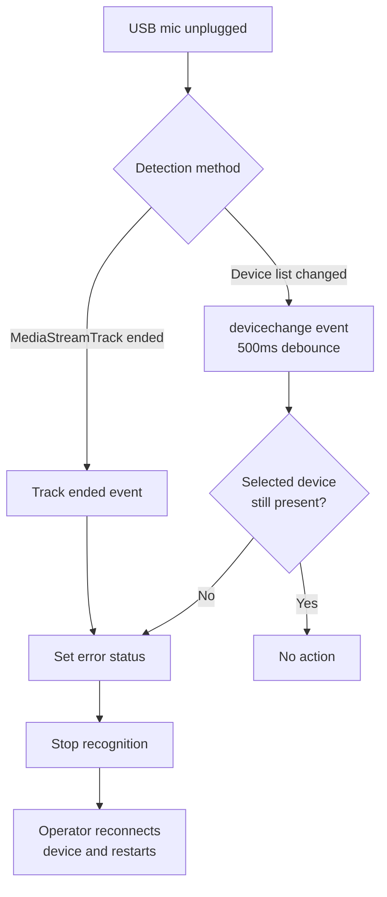
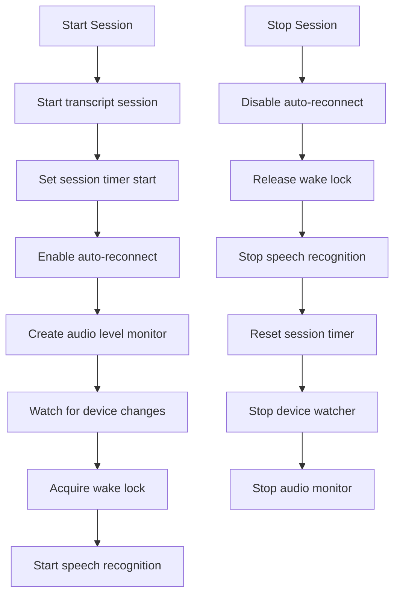
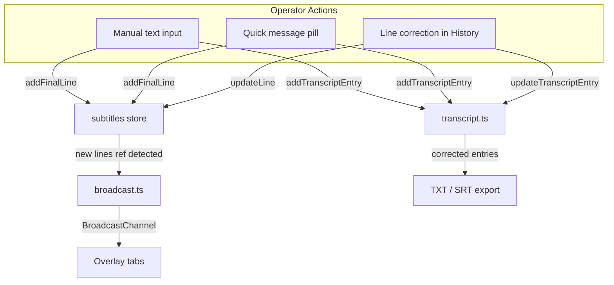
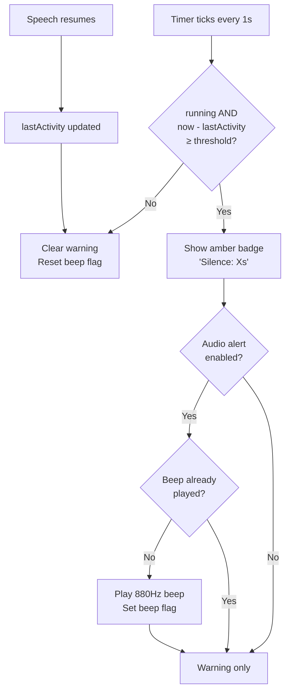

# LiveSubs

Real-time subtitling app for **Experts Live** IT conferences. Captures audio from a microphone or virtual audio device, transcribes speech using Azure Cognitive Services, optionally translates between languages, and displays configurable subtitles on a chroma-key green screen or transparent overlay.

Built for multi-hour live events with automatic reconnection, device disconnect detection, screen wake lock, session transcript export, OBS browser source integration, multi-output sync via BroadcastChannel, operator live controls (manual text injection, quick messages, inline line correction, silence detection with audio alerts), and operator-friendly features like keyboard shortcuts, shareable config URLs, QR codes, subtitle history, and settings presets.


## Architecture

```mermaid
graph LR
    A[Microphone / HDMI Audio] -->|Web Audio API| B[Operator Tab /]
    B -->|WebSocket| C[Azure Speech SDK]
    C -->|Partial + Final text| B
    B --> E[Config Panel + Preview]
    B -->|BroadcastChannel| OV1[/overlay tab\nReceiver mode]
    B -->|BroadcastChannel| OV2[/overlay tab\nConfidence monitor]

    OP[Operator Controls] -->|Manual text\nQuick messages\nLine corrections| B

    OV3[/overlay?key=...&region=...\nOBS Browser Source] -->|Own WebSocket| C

    subgraph Azure Cognitive Services
        C --> F[Speech-to-Text]
        F -->|if translation needed| G[Translation]
    end
```

### Multi-Output Architecture

The operator tab broadcasts subtitle and style state to other tabs via the BroadcastChannel API. A dedicated `/overlay` route renders subtitles on a transparent or configurable background.

```mermaid
flowchart TB
    subgraph Same Browser
        OP[Operator Tab /] -->|BroadcastChannel 'livesubs'| OV1[/overlay tab]
        OP -->|BroadcastChannel 'livesubs'| OV2[/overlay tab\non tablet]
    end

    subgraph OBS / Separate Process
        OV3[/overlay?key=...&region=...\nStandalone mode] -->|Own Azure session| AZ[Azure Speech]
    end

    style OP fill:#1B2A6B,color:#fff
    style OV1 fill:#2E7CC4,color:#fff
    style OV2 fill:#2E7CC4,color:#fff
    style OV3 fill:#F59E0B,color:#000
```

> **Key constraint:** BroadcastChannel only works between tabs in the **same browser process**. OBS browser sources run in an isolated CEF process and cannot receive these messages. For OBS, the `/overlay` route is self-sufficient — it reads config from URL params and starts its own Azure session.

### Recognizer Selection

The app chooses the optimal Azure recognizer based on language configuration:



### Data Flow



### Reconnection Flow

When Azure disconnects mid-session, the app automatically recovers:



### Device Disconnect Handling



### Session Lifecycle

The `session.ts` service centralizes session management, ensuring consistent behavior whether triggered by the UI button, keyboard shortcut, or device disconnect:



### Operator Intervention Flow

Manual text, quick messages, and line corrections all go through the same data path as speech recognition — modifying the `lines` array reference in the subtitles store. This means BroadcastChannel subscribers automatically detect and propagate changes to overlay tabs with no extra logic.



### Silence Detection Flow



## Tech Stack

| Component | Choice |
|-----------|--------|
| Framework | SvelteKit + TypeScript |
| Styling | Tailwind CSS v4 |
| Speech-to-text | Azure Cognitive Services Speech SDK |
| Translation | Azure Speech Translation (same SDK) |
| Architecture | Browser-direct — no backend server |
| Hosting | Azure Static Web Apps |
| State | Svelte writable stores + localStorage |

## Project Structure

```
src/
├── lib/
│   ├── components/
│   │   ├── SubtitleDisplay.svelte    # Styled subtitle renderer with entry animations
│   │   ├── ConfigPanel.svelte        # Main config UI, manual text, silence alerts
│   │   ├── StatusIndicator.svelte    # Activity/health dot overlay
│   │   ├── SubtitleHistory.svelte    # Scrollable transcript history with inline editing
│   │   ├── QrCode.svelte             # QR code canvas for sharing overlay URLs
│   │   ├── AudioDeviceSelector.svelte
│   │   ├── StyleControls.svelte      # Font, size, color, outline, position, animation
│   │   ├── PhraseListEditor.svelte   # IT terminology phrase list
│   │   ├── PresetManager.svelte      # Save/load named configuration presets
│   │   └── QuickMessages.svelte      # Quick message pills with edit mode
│   ├── stores/
│   │   ├── settings.ts               # Azure key, region, languages, device, phrases, profanity, alerts
│   │   ├── subtitles.ts              # Lines buffer, partial text, status, audio level, timer
│   │   ├── style.ts                  # Font, size, color, outline, position, maxLines, animation
│   │   ├── presets.ts                # Named configuration presets (localStorage-persisted)
│   │   └── quickMessages.ts          # Quick cue card messages (localStorage-persisted)
│   ├── services/
│   │   ├── session.ts                # Session lifecycle (start/stop orchestration)
│   │   ├── speech.ts                 # Azure Speech SDK wrapper + auto-detect + profanity
│   │   ├── audio.ts                  # Device enumeration, VU meter, disconnect detection
│   │   ├── broadcast.ts              # BroadcastChannel sender (throttled subtitle + style sync)
│   │   ├── broadcast-receiver.ts     # BroadcastChannel listener for overlay tabs
│   │   ├── reconnection.ts           # Auto-reconnect with exponential backoff
│   │   ├── transcript.ts             # Session recording + TXT/SRT export
│   │   ├── wakelock.ts               # Screen Wake Lock API wrapper
│   │   └── demo.ts                   # Demo mode with canned conference text
│   └── utils/
│       ├── phrases.ts                # ~90 default IT/cloud/Azure terms
│       └── url-params.ts             # URL query parameter read/write for shareable URLs
├── routes/
│   ├── +page.svelte                  # Operator page: config ↔ fullscreen toggle + shortcuts
│   ├── overlay/
│   │   └── +page.svelte              # Overlay output (receiver or standalone mode)
│   ├── +layout.svelte
│   └── +layout.ts                    # SSR disabled, prerender enabled
├── app.css                           # Tailwind v4 + Experts Live CSS variables
└── app.html
```

## Getting Started

### Prerequisites

- Node.js 22+
- An [Azure Speech Services](https://learn.microsoft.com/en-us/azure/ai-services/speech-service/) resource (S0 or free tier)

### Install and Run

```sh
npm install
npm run dev
```

Open the app in your browser, then:

1. Enter your **Azure Speech key** and **region** (e.g. `westeurope`)
2. Select an **audio input** device
3. Choose **source language** (or **Auto-detect**) and optional **translation target**
4. Press **Start** (or **Space**) — speak into the mic and see subtitles appear
5. Press **F** or the **Fullscreen** button for green-screen output

Alternatively, open a pre-configured URL (see [URL Parameters](#url-parameters)) or load a saved preset.

### Demo Mode

To test the app without Azure credentials, click the **Demo** button. This feeds canned conference text through the subtitle display at realistic typing speeds, simulating partial-to-final transitions. Demo mode does not require an Azure key or microphone.

### Build for Production

```sh
npm run build
```

Output is written to `build/` — a fully static site ready for any static host.

## Usage

### Config Panel

The left sidebar contains all settings:

- **Presets** — save and load named configurations for recurring rooms/events
- **Azure Speech** — subscription key and region
- **Language** — source language (English, Dutch, German, French, Spanish, or **Auto-detect**), optional translation target, and profanity filter (Masked/Removed/Raw)
- **Audio Input** — select microphone or virtual audio device
- **Subtitle Style** — font, size, color, text outline, position, alignment, max lines, and entry animation (None/Fade/Slide)
- **Alerts** — silence detection threshold and audio beep toggle
- **Phrase List** — IT terminology that boosts recognition accuracy (pre-loaded with ~90 Azure/cloud/DevOps terms)
- **Copy URL** — button in the header copies a shareable URL with current settings (Shift+click to include the Azure key)
- **Overlay** — open overlay window, copy overlay URL (for OBS), scan QR code to share with crew

### Controls

| Button | Shortcut | Action |
|--------|----------|--------|
| **Start** | `Space` | Begin recognition session (connects to Azure, acquires wake lock, starts transcript, starts session timer) |
| **Stop** | `Space` | End session (disconnects, releases resources, stops timer) |
| **Demo** | | Run demo mode with sample text (no Azure key needed) |
| **Clear** | `C` | Clear displayed subtitles |
| **Export** | | Download session transcript as TXT or SRT |
| **Fullscreen** | `F` | Enter green-screen output mode |
| **Send** (manual text) | `T` then `Enter` | Focus manual text input, type message, send as subtitle line |
| **History** | | Toggle subtitle history panel (replaces preview) |
| **Open Overlay** | | Open `/overlay` in a new window (receiver mode) |
| **Copy Overlay URL** | | Copy overlay URL for OBS (Shift+click to include Azure key) |

### Fullscreen Green Screen

Press **F** or click **Fullscreen** to enter chroma-key mode:

- Pure `#00FF00` green background
- Only subtitles are visible (no UI chrome)
- Designed for OBS/vMix chroma key into a video feed
- Press **Escape** to return to config

### Overlay Route (`/overlay`)

A dedicated output page for OBS browser sources, confidence monitors, and crew tablets. The overlay automatically selects the right operating mode:

```mermaid
flowchart TD
    A[/overlay opened] --> B[Start BroadcastChannel listener]
    B --> C{Message received\nwithin 2 seconds?}
    C -->|Yes| D[Receiver mode\nPassive — synced to operator]
    C -->|No| E[Read URL params]
    E --> F{key + region\nin URL?}
    F -->|Yes| G[Standalone mode\nStarts own Azure session]
    F -->|No| H[Waiting mode\nShows 'Waiting for operator...']
    D --> I[Render SubtitleDisplay]
    G --> I
    H --> I
```

**Receiver mode** — Subtitle and style data arrives via BroadcastChannel from the operator tab in the same browser. No Azure credentials needed. Use for confidence monitors and crew tablets on the same machine.

**Standalone mode** — Reads settings from URL parameters and starts its own Azure session. Use for OBS browser sources (which run in an isolated process and can't receive BroadcastChannel messages).

**Background color** — Controlled by the `?bg=` parameter:

| Value | Result |
|-------|--------|
| `transparent` (default) | True alpha transparency (ideal for OBS) |
| `green` | `#00FF00` chroma key green |
| `black` | Black background |
| Any hex color | Custom color (e.g. `#1B2A6B`) |

A small semi-transparent status badge in the top-left corner shows: **Live** (receiving broadcast), **Standalone** (own session), or **Waiting...** (no data).

### OBS Browser Source Setup

Add `/overlay?bg=transparent` as an OBS browser source for true alpha transparency — no chroma key needed:

1. In OBS, add a **Browser** source
2. Set URL to `https://your-app.com/overlay?bg=transparent`
3. Set width/height to match your scene (e.g. 1920x1080)
4. For standalone mode (recommended for OBS), include Azure credentials in the URL:
   `https://your-app.com/overlay?bg=transparent&region=westeurope&source=en-US&key=YOUR_KEY`
5. Subtitles render with true alpha transparency over your scene

> **Tip:** Use the **Copy Overlay URL** button in the operator panel (Shift+click to include the Azure key) to generate the URL.

### Overlay Controls

The operator panel status bar includes overlay management buttons:

| Button | Action |
|--------|--------|
| **Open Overlay** | Opens `/overlay` in a new browser window (receiver mode) |
| **Copy Overlay URL** | Copies the overlay URL with `?bg=transparent` for OBS. Shift+click to include the Azure key. |

### Operator Live Controls

During a live event, the operator can intervene in the subtitle stream without stopping recognition:

#### Manual Text Input

A text input bar is always available in the main area, between the status bar and the preview/history panel. Type a message and press **Enter** (or click **Send**) to inject it as a subtitle line. Press `T` from anywhere to focus the input. Works whether or not a recognition session is running — useful for pre-show messages like "Starting soon..." or recovery messages during technical difficulties.

#### Quick Messages

Below the manual text input, a row of pill-shaped buttons provides one-click cue cards. Click a pill to instantly send that message as a subtitle line. Default messages: "Please wait...", "We'll resume shortly", "Q&A session", "Thank you!".

Click **Edit** to enter edit mode where you can:
- Click a pill to rename it
- Click **x** to delete a pill
- Type in the "New..." field and click **+** to add a custom message

Quick messages persist across browser sessions via localStorage.

#### Inline Line Correction

In the History panel, click any line to edit it in place. Press **Enter** or blur the input to save the correction, or **Escape** to cancel. Corrections propagate immediately to:
- The subtitle display
- All connected overlay tabs (via BroadcastChannel)
- The session transcript (so exports reflect the corrected text)

Lines show a dotted underline on hover to indicate they are editable.

#### Silence Detection

When a recognition session is running and no speech activity has been detected for a configurable period (default: 15 seconds), an amber pulsing **"Silence: Xs"** badge appears in the status bar next to the VU meter.

If the **Audio beep on silence** option is enabled, a short 880Hz tone plays once when the threshold is first exceeded. The beep resets when speech resumes and will fire again on the next silence period.

Configure both settings in the **Alerts** section of the sidebar:
- **Silence threshold** — 5 to 120 seconds (default: 15)
- **Audio beep on silence** — checkbox toggle (default: off)

### Subtitle History

Click the **History** button in the status bar to toggle a scrollable transcript view:

- Shows all recognized lines with timestamps relative to session start
- Auto-scrolls to the latest line; scrolling up pauses auto-scroll
- **Copy All** button copies the full transcript to clipboard
- Click any line to edit it inline (see [Inline Line Correction](#inline-line-correction))
- Displays up to 100 lines (the existing buffer cap)

### QR Code

When the history panel is open, a QR code is displayed below it encoding the overlay URL (without Azure key). Crew members can scan it with a phone or tablet to open the overlay in their browser:

- Same-device tabs use BroadcastChannel (receiver mode)
- Cross-device opens show "Waiting for operator..." since BroadcastChannel is same-browser only

### Status Indicator

A small dot overlay appears in the top-right corner of the subtitle display:

| Color | Meaning |
|-------|---------|
| Green (pulsing) | Connected, speech activity within last 5 seconds |
| Amber (steady) | Connected, but no speech detected for 5+ seconds |
| Red (blinking) | Error or reconnecting |
| Hidden | Disconnected |

### Transcript Export

Every recognized line is recorded with a timestamp during the session. Click **Export** to download:

- **TXT** — timestamped plain text (`[HH:MM:SS] text`)
- **SRT** — standard subtitle format (compatible with video editors)

The entry count is shown on the Export button.

### Keyboard Shortcuts

All shortcuts are disabled when focus is in a text input, select, or textarea.

| Key | Action |
|-----|--------|
| `Space` | Toggle Start / Stop recognition |
| `C` | Clear subtitles |
| `F` | Toggle fullscreen green screen |
| `T` | Focus manual text input |
| `Escape` | Exit fullscreen / blur manual text input |

### URL Parameters

Pre-configure the app via URL query parameters — useful for bookmarking per-room setups or sharing with operators:

| Parameter | Maps to | Example |
|-----------|---------|---------|
| `region` | Azure region | `westeurope` |
| `source` | Source language | `nl-NL`, `auto` |
| `target` | Target language | `en` |
| `device` | Audio device ID | (device-specific) |
| `key` | Azure Speech key | (stripped from URL after loading) |
| `font` | Font family | `Arial, sans-serif` |
| `fontSize` | Font size | `48` |
| `maxLines` | Max subtitle lines | `2` |
| `position` | Subtitle position | `top`, `center`, `bottom` |
| `align` | Text alignment | `left`, `center`, `right` |
| `bg` | Background color (`/overlay` only) | `transparent`, `green`, `black`, `#1B2A6B` |

Examples:
- Operator config: `https://your-app.com/?region=westeurope&source=nl-NL&target=en&fontSize=56`
- OBS overlay: `https://your-app.com/overlay?bg=transparent&region=westeurope&source=en-US&key=YOUR_KEY`

The `key` parameter is automatically removed from the browser address bar after loading to prevent accidental leaking in screenshots or bookmarks.

### Settings Presets

Save named configurations for recurring events or multi-room setups:

1. Configure all settings as desired
2. Expand the **Presets** section in the sidebar
3. Enter a name (e.g. "Main Stage EN→NL") and click **Save**
4. To restore: click **Load** on any saved preset

Presets persist across browser sessions via localStorage. The Azure key is excluded from presets for security.

### Auto-detect Source Language

When **Auto-detect** is selected as the source language, Azure automatically identifies which language is being spoken from a list of candidate languages. This is useful at multilingual conferences where speakers may switch between languages mid-session.

Select at least 2 candidate languages from the checkbox list that appears. More candidates may slightly increase latency.

### Profanity Filter

Controls how Azure handles profanity in recognized speech:

| Mode | Behavior |
|------|----------|
| **Masked** (default) | Profanity replaced with `***` |
| **Removed** | Profanity silently dropped |
| **Raw** | No filtering applied |

### Subtitle Animations

Subtitle lines can animate in rather than appearing instantly:

| Mode | Effect |
|------|--------|
| **None** | Instant appearance |
| **Fade** (default) | 200ms fade in |
| **Slide** | 250ms slide up with fade |

Partial (in-progress) text is never animated since it updates too frequently.

### Session Timer

When a session is running, the status bar displays elapsed time in `HH:MM:SS` format next to the connection indicator. The timer resets on each new session start and disappears when the session stops. Useful for tracking conference slot durations and estimating Azure costs.

## Production Hardening

Features designed for reliability during multi-hour live conferences:

- **Auto-reconnection** — transient network errors trigger exponential backoff reconnection (1s to 30s, max 10 attempts). Authentication and permission errors are not retried.
- **Device disconnect detection** — unplugging a USB mic is detected via `MediaStreamTrack.ended` events and `devicechange` listeners. Recognition is stopped with a clear error message.
- **Screen Wake Lock** — prevents the OS from sleeping the display during a session. Automatically re-acquires the lock when the tab regains visibility.
- **Tab visibility handling** — when the browser tab is backgrounded and restored, the audio context is automatically resumed to prevent VU meter stalls.
- **Partial text overflow fix** — when partial (in-progress) text is present, one line slot is reserved for it so the display never exceeds the configured `maxLines`.
- **Derived connection state** — the Start/Stop button state is derived directly from the subtitle store's `connectionStatus`, eliminating UI desync if recognition fails to start.
- **BroadcastChannel throttling** — partial-text-only updates to overlay tabs are throttled to max 5/sec (200ms), while final lines, status changes, and style changes are sent immediately. A 3-second ping heartbeat lets receivers detect operator disconnection.

## Deployment

### Azure Static Web Apps

The repo includes a GitHub Actions workflow (`.github/workflows/azure-static-web-apps.yml`).

1. Create an Azure Static Web App resource
2. Add the deployment token as `AZURE_STATIC_WEB_APPS_API_TOKEN` in GitHub repo secrets
3. Push to `main` — the workflow builds and deploys automatically

### Estimated Costs

| Service | Cost |
|---------|------|
| Azure Speech (STT) | ~$1.00/hour |
| Azure Speech Translation | ~$2.50/hour |
| Azure Static Web Apps | Free tier or ~$9/month |
| **Per 1-hour event** | **~$1.00–$2.50** |

## License

See [LICENSE](LICENSE).
