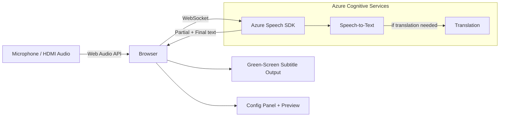
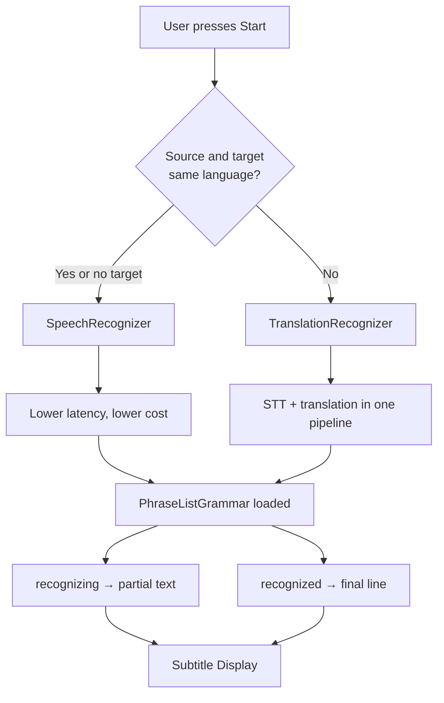
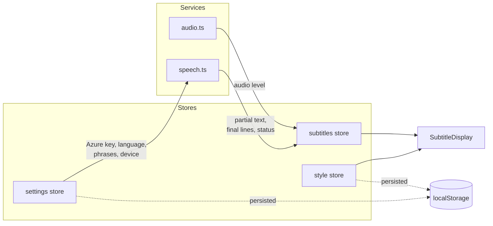

# LiveSubs

Real-time subtitling app for **Experts Live** IT conferences. Captures audio from a microphone or virtual audio device, transcribes speech using Azure Cognitive Services, optionally translates between English and Dutch, and displays configurable subtitles on a chroma-key green screen.


## Architecture



### Recognizer Selection

The app chooses the optimal Azure recognizer based on language configuration:



### Data Flow



## Tech Stack

| Component | Choice |
|-----------|--------|
| Framework | SvelteKit + TypeScript |
| Styling | Tailwind CSS v4 |
| Speech-to-text | Azure Cognitive Services Speech SDK |
| Translation | Azure Speech Translation (same SDK) |
| Architecture | Browser-direct — no backend server |
| Hosting | Azure Static Web Apps |
| State | Svelte writable stores + localStorage |

## Project Structure

```
src/
├── lib/
│   ├── components/
│   │   ├── SubtitleDisplay.svelte    # Styled subtitle renderer (preview + fullscreen)
│   │   ├── ConfigPanel.svelte        # Main config UI (Experts Live branded)
│   │   ├── AudioDeviceSelector.svelte
│   │   ├── StyleControls.svelte      # Font, size, color, outline, position
│   │   └── PhraseListEditor.svelte   # IT terminology phrase list
│   ├── stores/
│   │   ├── settings.ts               # Azure key, region, languages, device, phrases
│   │   ├── subtitles.ts              # Lines buffer, partial text, status, audio level
│   │   └── style.ts                  # Font, size, color, outline, position, maxLines
│   ├── services/
│   │   ├── speech.ts                 # Azure Speech SDK wrapper
│   │   └── audio.ts                  # Device enumeration + VU meter
│   └── utils/
│       └── phrases.ts                # ~90 default IT/cloud/Azure terms
├── routes/
│   ├── +page.svelte                  # Single page: config ↔ fullscreen toggle
│   ├── +layout.svelte
│   └── +layout.ts                    # SSR disabled, prerender enabled
├── app.css                           # Tailwind v4 + Experts Live CSS variables
└── app.html
```

## Getting Started

### Prerequisites

- Node.js 22+
- An [Azure Speech Services](https://learn.microsoft.com/en-us/azure/ai-services/speech-service/) resource (S0 or free tier)

### Install and Run

```sh
npm install
npm run dev
```

Open the app in your browser, then:

1. Enter your **Azure Speech key** and **region** (e.g. `westeurope`)
2. Select an **audio input** device
3. Choose **source language** and optional **translation target**
4. Press **Start** — speak into the mic and see subtitles appear
5. Press **F** or the **Fullscreen** button for green-screen output

### Build for Production

```sh
npm run build
```

Output is written to `build/` — a fully static site ready for any static host.

## Usage

### Config Panel

The left sidebar contains all settings:

- **Azure Speech** — subscription key and region
- **Language** — source language (English, Dutch, German, French, Spanish) and optional translation target
- **Audio Input** — select microphone or virtual audio device
- **Subtitle Style** — font, size, color, text outline, position, alignment, max lines
- **Phrase List** — IT terminology that boosts recognition accuracy (pre-loaded with ~90 Azure/cloud/DevOps terms)

### Fullscreen Green Screen

Press **F** or click **Fullscreen** to enter chroma-key mode:

- Pure `#00FF00` green background
- Only subtitles are visible (no UI chrome)
- Designed for OBS/vMix chroma key into a video feed
- Press **Escape** to return to config

### Keyboard Shortcuts

| Key | Action |
|-----|--------|
| `F` | Toggle fullscreen green screen |
| `Escape` | Exit fullscreen |

## Deployment

### Azure Static Web Apps

The repo includes a GitHub Actions workflow (`.github/workflows/azure-static-web-apps.yml`).

1. Create an Azure Static Web App resource
2. Add the deployment token as `AZURE_STATIC_WEB_APPS_API_TOKEN` in GitHub repo secrets
3. Push to `main` — the workflow builds and deploys automatically

### Estimated Costs

| Service | Cost |
|---------|------|
| Azure Speech (STT) | ~$1.00/hour |
| Azure Speech Translation | ~$2.50/hour |
| Azure Static Web Apps | Free tier or ~$9/month |
| **Per 1-hour event** | **~$1.00–$2.50** |

## License

See [LICENSE](LICENSE).
