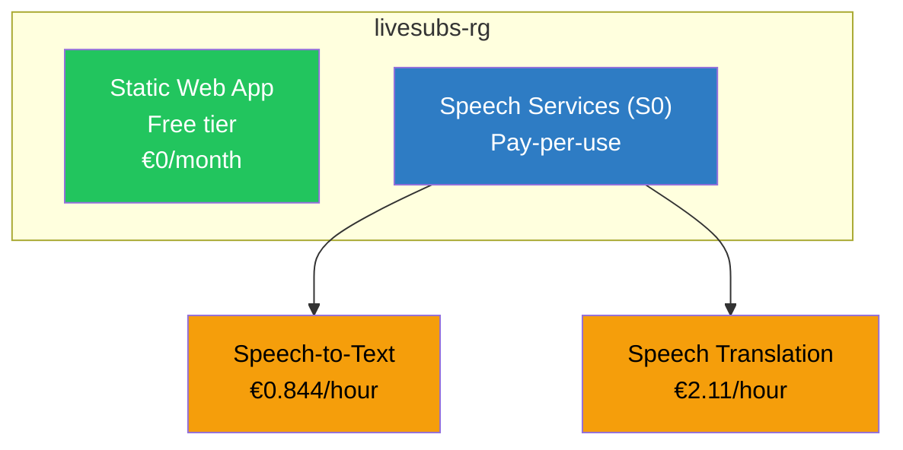
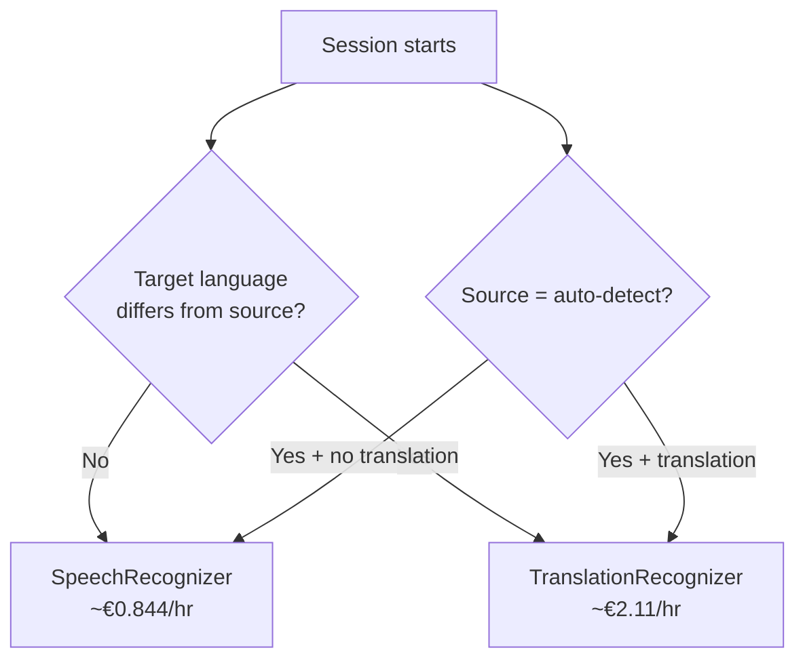
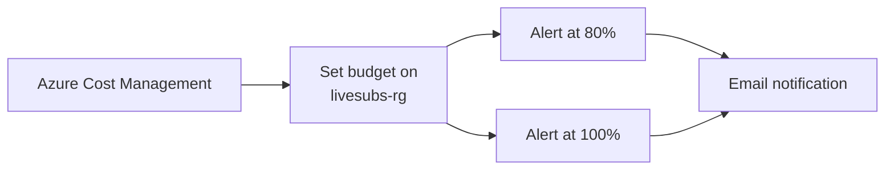

# Azure Costs for LiveSubs

Detailed cost breakdown for running LiveSubs at Experts Live conferences. All prices are pay-as-you-go EUR estimates for the **West Europe** region as of February 2026. Prices may vary — check the [Azure pricing calculator](https://azure.microsoft.com/en-us/pricing/calculator/) for current rates.

## Resource Overview

## Azure Speech Services (S0 Tier)

The Speech SDK connects directly from the browser to Azure — there is no backend server. Billing is based on audio duration processed.

### Speech-to-Text (STT)

Used when source and target language are the same (no translation needed).

| Metric | Value |
|--------|-------|
| Price per audio hour | ~€0.844 |
| Billing increment | Per second |
| Concurrent sessions | Unlimited (S0) |
| Free tier (F0) | 5 hours/month |

### Speech Translation

Used when the target language differs from the source, or when auto-detect is enabled with a translation target.

| Metric | Value |
|--------|-------|
| Price per audio hour | ~€2.11 |
| Billing increment | Per second |
| Concurrent sessions | Unlimited (S0) |

### Which Recognizer Is Used?

> **Cost tip:** If you only need transcription in the speaker's language (no translation), select a specific source language and leave "Translate To" set to "None". This uses the cheaper SpeechRecognizer path.

### Silence and Idle Time

Azure bills for audio duration, not wall-clock time. However, the Speech SDK keeps the WebSocket connection open during silence. Key behaviors:

- **Short silence** (< 15s): The recognizer stays active and bills for the connection time
- **Long silence**: After the silence threshold (configurable, default 15s), LiveSubs shows a warning but keeps the session open — audio is still being streamed
- **Stopped session**: No charges accrue when the session is stopped

> **Cost tip:** Stop the session during long breaks (lunch, room changeover). The operator can restart instantly when the next speaker begins.

## Azure Static Web Apps

| Tier | Price | Bandwidth | Custom domains |
|------|-------|-----------|----------------|
| **Free** (current) | €0/month | 100 GB/month | 2 |
| Standard | ~€8.44/month | 100 GB included | 5 |

The Free tier is sufficient for LiveSubs — the static build is ~500 KB and the app serves a small number of operators and overlay tabs per event. Bandwidth is negligible since all heavy lifting (speech processing) happens between the browser and Azure Speech directly.

## Event Cost Scenarios

### Single-Track Conference (1 day)

```mermaid
gantt
    title Cost timeline — 1-day conference
    dateFormat HH:mm
    axisFormat %H:%M

    section Sessions
    Keynote (EN→NL)       :a1, 09:00, 1h
    Break                 :crit, 10:00, 30m
    Session 1 (EN only)   :a2, 10:30, 1h
    Lunch                 :crit, 11:30, 1h
    Session 2 (NL→EN)     :a3, 12:30, 1h
    Break                 :crit, 13:30, 15m
    Session 3 (EN only)   :a4, 13:45, 1h
    Closing (EN→NL)       :a5, 14:45, 30m
```

| Session | Duration | Type | Cost |
|---------|----------|------|------|
| Keynote (EN→NL) | 1h | Translation | €2.11 |
| Session 1 (EN only) | 1h | STT only | €0.84 |
| Session 2 (NL→EN) | 1h | Translation | €2.11 |
| Session 3 (EN only) | 1h | STT only | €0.84 |
| Closing (EN→NL) | 0.5h | Translation | €1.06 |
| **Total speech** | **4.5h** | | **€6.96** |
| Static Web App | — | Free tier | €0.00 |
| **Total event cost** | | | **~€7** |

### Multi-Track Conference (2 days, 3 parallel tracks)

| Item | Calculation | Cost |
|------|-------------|------|
| Track 1: 12h translation | 12 × €2.11 | €25.32 |
| Track 2: 12h STT only | 12 × €0.84 | €10.08 |
| Track 3: 12h mixed (50/50) | 6 × €2.11 + 6 × €0.84 | €17.70 |
| Static Web App | Free tier | €0.00 |
| **Total 2-day event** | | **~€53** |

### Monthly Recurring (weekly meetup, 2h each)

| Item | Calculation | Cost/month |
|------|-------------|------------|
| 4 × 2h STT sessions | 8 × €0.84 | €6.72 |
| Static Web App | Free tier | €0.00 |
| **Monthly total** | | **~€7** |

## Cost Optimization Tips

1. **Use STT-only when possible** — If the audience speaks the same language as the presenter, skip translation. Costs drop from ~€2.11/h to ~€0.84/h.

2. **Stop sessions during breaks** — The operator should press Stop during coffee breaks and lunch. Restarting takes ~2 seconds.

3. **Use the Free Speech tier (F0) for testing** — The F0 tier provides 5 free hours/month. Create a separate F0 resource for rehearsals and testing, keep S0 for production events.

4. **Monitor usage** — Check costs in the Azure portal under **Cost Management** for the `livesubs-rg` resource group.

5. **Set budget alerts** — Create a budget alert in Azure Cost Management to get notified if Speech costs exceed a threshold (e.g. €50/month).

## Scaling Considerations

| Scenario | Impact |
|----------|--------|
| More overlay tabs (same browser) | No extra cost — uses BroadcastChannel |
| OBS standalone overlay | +1 concurrent Speech session (doubles Speech cost) |
| Multiple rooms, same Azure key | Each room = 1 session, costs add linearly |
| Multiple concurrent languages per room | 1 session per language pair |

> **Important:** Each OBS browser source in standalone mode opens its own WebSocket to Azure Speech, creating a separate billable session. For cost efficiency, prefer BroadcastChannel receiver mode (same-browser overlay tabs) when possible. Only use standalone mode for OBS, which requires it due to process isolation.

## Resource Limits (S0 Tier)

| Limit | Value |
|-------|-------|
| Concurrent STT sessions | 100 |
| Concurrent translation sessions | 100 |
| Audio length per request | Unlimited (continuous) |
| Requests per second | 100 |
| Max audio channels | 1 (mono, browser mic) |

These limits are far beyond what a typical conference needs. A 10-track conference with OBS overlays would use at most ~20 concurrent sessions.
